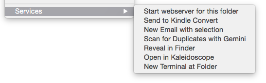
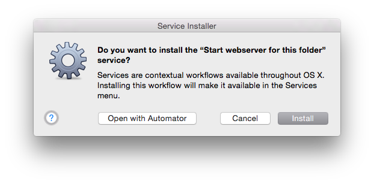

# servefolder
OSX service to start a webserver on a folder


## usage
Installs service in osx context menu to start a simple webserver on a server.




## install

```bash
# scripts expects a workspace
cd 
mkdir -p workspace
cd workspace
# clone repos
git clone https://github.com/erikdejonge/servefolder.git
```

Double click "Start webserver for this folder.workflow" 


and choose install as service

